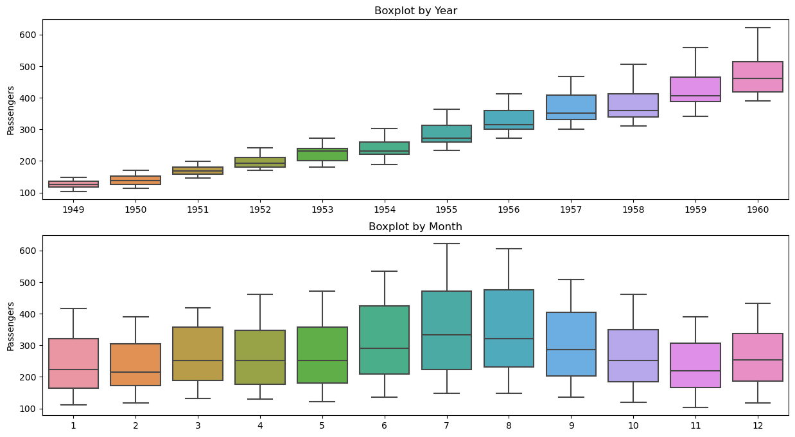
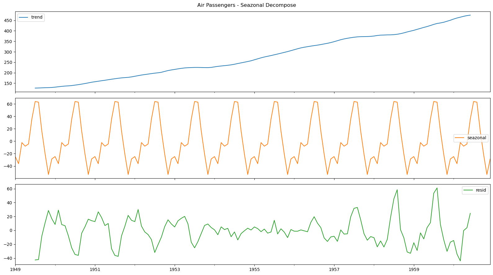
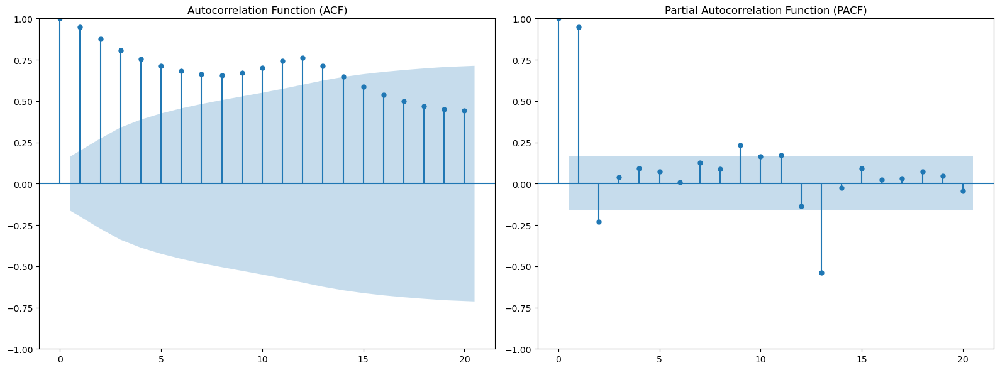
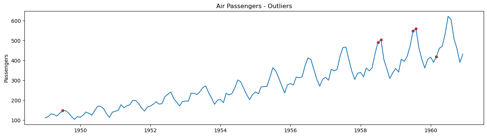
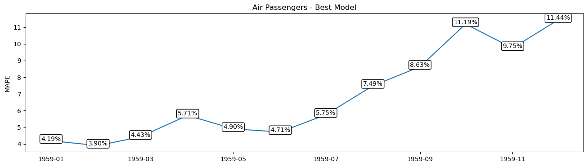
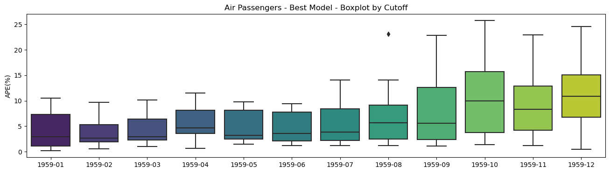
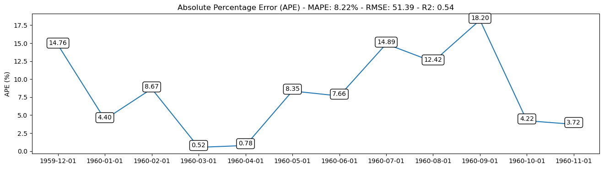
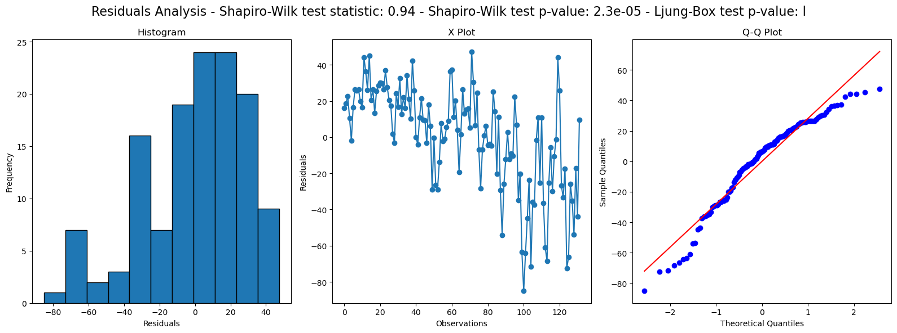

# Time Series Forecasting

### DataFrame Air Passengers
   Veja mais detalhes em github: https://github.com/facebook/prophet/tree/master/examples

---

### Demonstração de Modelos de Previsão Temporal

Este repositório contém dois notebooks que destacam a aplicação de técnicas de previsão em séries temporais. 

#### Notebook 1: Utilização do Prophet

No primeiro notebook, você encontrará demonstrações detalhadas do uso da biblioteca Prophet para previsões temporais. O Prophet é uma ferramenta robusta e eficaz para análise e previsão de séries temporais, e suas funcionalidades são exploradas neste contexto.

1. **Boxplot por Ano e Mês:**
   - O boxplot apresenta uma visão estatística das distribuições mensais ao longo dos anos, destacando padrões sazonais.

   

2. **Decomposição STL:**
   - A decomposição usando STL (Seasonal-Trend decomposition using LOESS) separa a série temporal em componentes de tendência, sazonalidade e resíduo.

   

3. **ACF e PACF:**
   - Os gráficos de autocorrelação (ACF) e autocorrelação parcial (PACF) ajudam na identificação de padrões de dependência temporal na série.

   

4. **Detecção de Outliers:**
   - Técnicas de detecção de outliers são aplicadas para identificar pontos atípicos que podem impactar as previsões.

   

5. **MAPE em Função dos Cutoffs:**
   - O gráfico relaciona o Mean Absolute Percentage Error (MAPE) com diferentes valores de cutoff, fornecendo insights sobre a sensibilidade do modelo a diferentes configurações.

   

6. **Boxplots de APES:**
   - Os boxplots de Absolute Percentage Error (APES) oferecem uma visão consolidada da distribuição dos erros percentuais absolutos.

   

#### Notebook 2: Demonstração de Regressão Linear

O segundo notebook apresenta demonstrações de uma abordagem baseada em regressão linear para análise previsões temporais. A regressão linear é uma técnica fundamental em estatística e machine learning, e sua aplicação neste projeto é explorada de maneira prática.

1. **Grid Search e Backtest:**
   - Uma técnica de Grid Search é utilizada para explorar diferentes combinações de hiperparâmetros do modelo de regressão linear. O backtest é realizado para avaliar o desempenho do modelo em dados não vistos.

2. **Gráfico de Erro APE ao Longo do Tempo:**
   - O gráfico exibe a evolução do erro em termos de Absolute Percentage Error (APE) ao longo do tempo, proporcionando insights sobre a estabilidade e consistência do modelo.

   

3. **Análise de Resíduos:**
   - A análise de resíduos é realizada com testes estatísticos de Shapiro-Wilk e Ljung-Box para avaliar a normalidade e independência dos resíduos, respectivamente.

   
---
